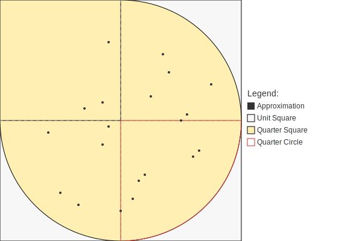

# Übung 7 - Exercise 7

## German

Aufgabebeschreibung:
*Implementieren Sie den folgenden Algorithmus zur statistischen Approximation des Wertes von Pi:*

Monte Carlo Methode zur Approximation von Pi:

1. Wiederholen Sie die folgenden Schritte 'n'-mal (wobei 'n' vom Benutzer angegeben wird):
    - Generieren Sie zufällige Paare (x, y) von Zahlen im Bereich [0...1] mithilfe der Methode Math.random():

        ```java
        double x = Math.random();
        double y = Math.random();
        ```

    - Berechnen Sie den Wert von dist mit der Gleichung: `dist = x * x + y * y`
    - Falls dist <= 1.0 ist, erhöhen Sie die Zählervariable 'count' um eins:

        ```java
        if (dist <= 1.0) {
            count++;
        }
        ```

1. Am Ende wird die Approximation für π berechnet durch: `Pi ≈ 4 * count / n`
1. Drucken Sie das Ergebnis aus und vergleichen Sie es mit dem genaueren Wert von Pi, der durch die Konstante Math.PI in Java bereitgestellt wird.
1. Einheitskreis:
    - Radius (r) = 1
    - Gleichung: x² + y² = 1
    - Fläche des Viertelkreises = π / 4
    - Fläche des Viertelquadrats = 1
    - Verhältnis des Viertelkreises zum Viertelquadrat = π / 4
    - Verteilung der "Treffer" im Viertelkreis und Viertelquadrat approximiert das Verhältnis für große Zahlen.
1. Visualisierung der Pi-Berechnung mithilfe einer Monte Carlo Simulation:

    

    Hinweis: Die obige Visualisierung veranschaulicht den Prozess des Generierens von zufälligen Punkten innerhalb des Einheitsquadrats und des Zählens der Treffer im Viertelkreis. Das Verhältnis der Treffer im Viertelkreis zur Gesamtanzahl der Punkte wird verwendet, um den Wert von Pi zu approximieren.

## English

Task Description:
*Implement the following algorithm for a statistical approximation of the value of Pi:*

Monte Carlo Method for Approximating Pi:

1. Repeat the following steps 'n' times (where 'n' is provided by the user):
    - Generate random pairs (x, y) of numbers in the range [0...1] using the method Math.random():

        ```java
        double x = Math.random();
        double y = Math.random();
        ```

    - Calculate the value of dist using the equation: `dist = x * x + y * y`
    - If dist <= 1.0, increment the counter variable 'count' by one:

        ```java
        if (dist <= 1.0) {
            count++;
        }
        ```

1. At the end, the approximation for π is given by: `Pi ≈ 4 * count / n`
1. Print the result and compare it with the more accurate value of Pi provided by the constant Math.PI in Java.
1. Unit Circle:
    - Radius (r) = 1
    - Equation: x² + y² = 1
    - Area of the quarter circle (Viertelkreis) = π / 4
    - Area of the quarter square (Viertelquadrat) = 1
    - Ratio of the quarter circle to the quarter square = π / 4
    - Distribution of "hits" in the quarter circle and the quarter square approximates the ratio for large numbers.

1. Visualization of Pi Calculation using Monte Carlo Simulation:

    

    Note: The visualization above illustrates the process of generating random points within the unit square and counting the hits within the quarter circle. The ratio of hits within the quarter circle to the total number of points is used to approximate the value of Pi.

## General Information

1. Folder Structure
    1. The workspace contains two folders by default, where:
        - `src`: the folder to maintain sources
        - `lib`: the folder to maintain dependencies
    1. Meanwhile, the compiled output files will be generated in the `bin` folder by default.
1. Dependency Management
    1. The `JAVA PROJECTS` view allows you to manage your dependencies. More details can be found [here](https://github.com/microsoft/vscode-java-dependency#manage-dependencies).
